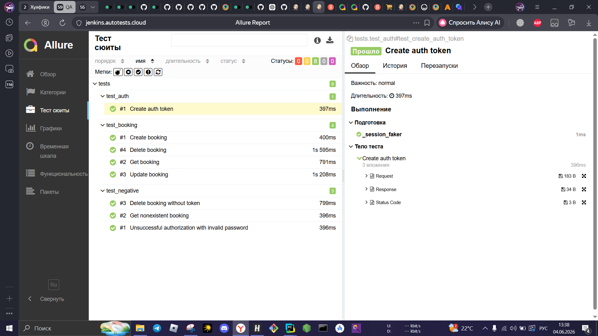
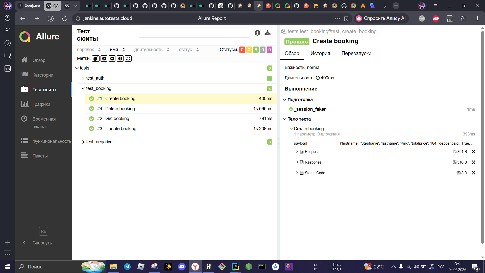
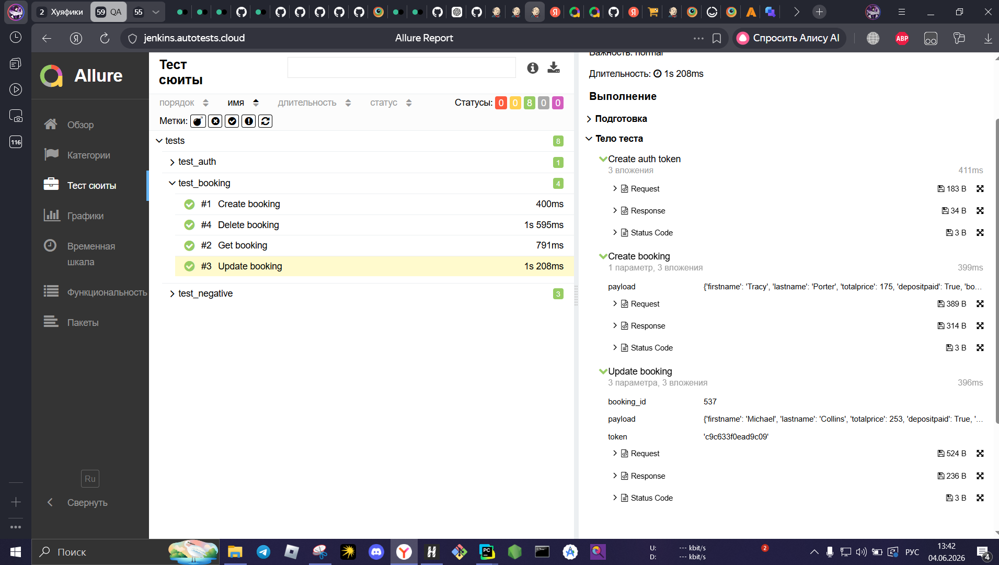
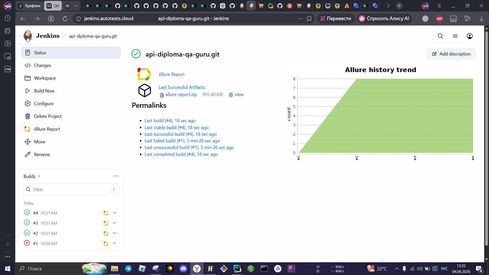
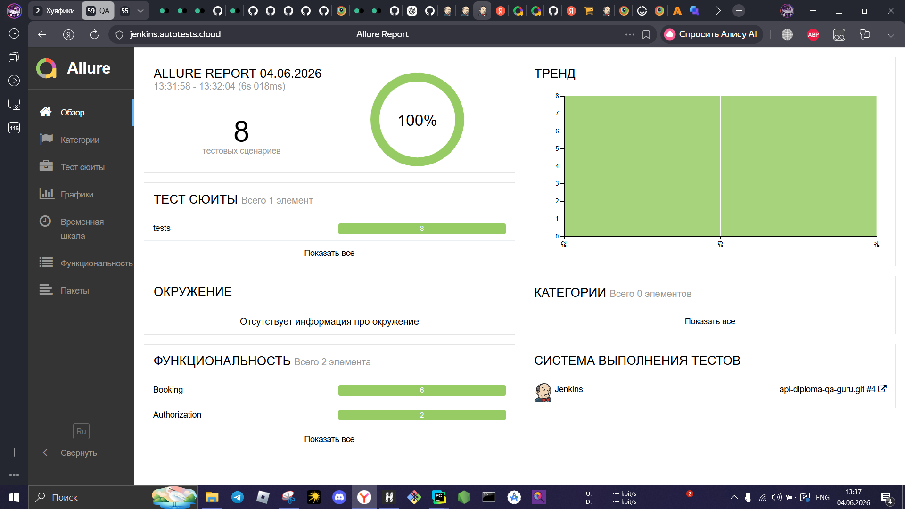

🚀 API Diploma Project | Restful Booker


## 📌 Project Overview

This project demonstrates API test automation for the Restful Booker application.

The framework was built using modern QA automation practices and includes:

- API CRUD testing
- Authorization testing
- Positive and negative scenarios
- Request / Response logging
- Allure reporting
- Jenkins integration
- Service Layer architecture
- Test data generation with Fake

## 🏗 Project Structure

```text
api-diploma-qa-guru

├── tests
│   ├── test_auth.py
│   ├── test_booking.py
│   └── test_negative.py
│
├── services
│   ├── auth_service.py
│   └── booking_service.py
│
├── models
│   ├── request
│   └── response
│
├── config
│   └── settings.py
│
├── utils
│   ├── attachments.py
│   └── generators.py
│
├── requirements.txt
├── pytest.ini
└── README.md

```

## 🛠 Technology Stack

| Technology | Purpose |
|------------|----------|
| Python | Programming language |
| Pytest | Test runner |
| Requests | API testing |
| Faker | Test data generation |
| Allure Report | Reporting |
| Jenkins | CI/CD |
| GitHub | Version control |

## 🎯 Implemented Test Scenarios

### Authorization

- Create auth token
- Unsuccessful authorization with invalid password

### Booking

- Create booking
- Get booking
- Update booking
- Delete booking

### Negative Tests

- Get nonexistent booking
- Delete booking without token


[Allure Suites]



[Create Booking Test]



[Update Booking Test]



[Jenkins Successful Build]
                                                        


[Allure Overview]



🚀 Run Tests

Install dependencies:

pip install -r requirements.txt

Run all tests:

pytest tests

Generate Allure results:

pytest tests --alluredir=allure-results

Open Allure report:

allure serve allure-results


## 👨‍💻 Author

<table>
<tr>
<td>

**Leonid Chaliy**

QA Automation Engineer

Portfolio Project

2026

</td>
</tr>
</table>
